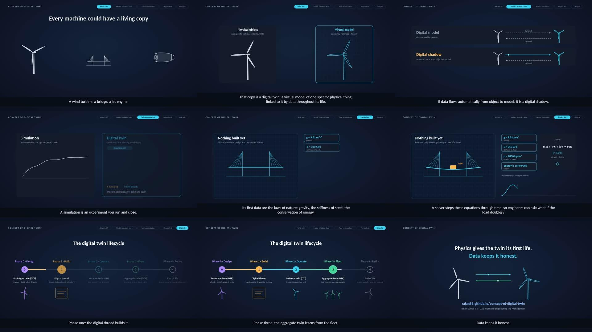
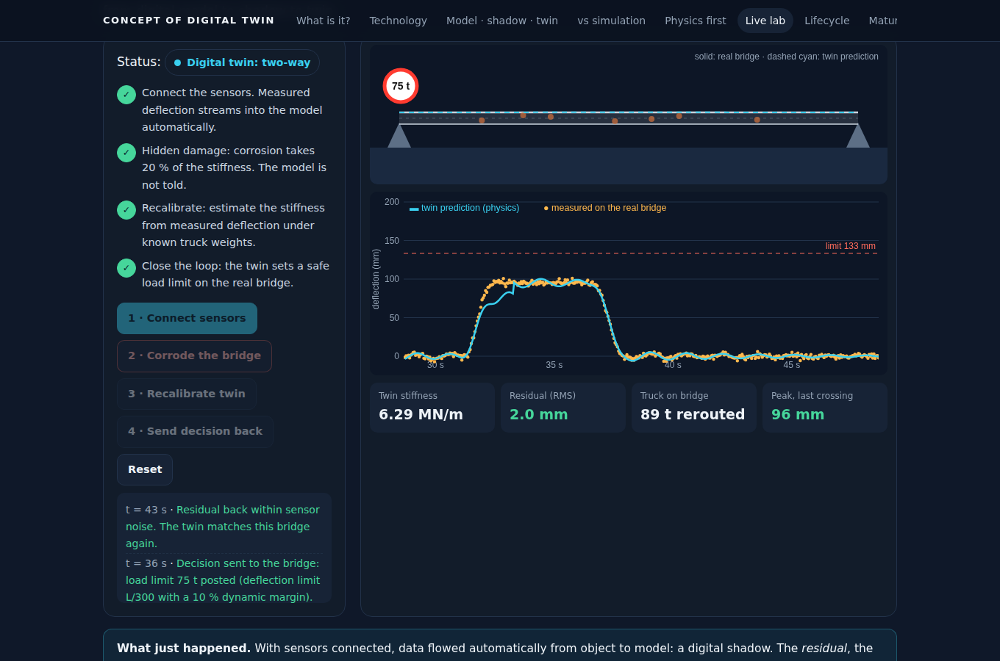

# Concept of Digital Twin

**Live page:** https://rajan56.github.io/concept-of-digital-twin/

Teaching material on digital twins for bachelor's, master's and doctoral students. It starts from the foundations and works up to the full lifecycle, with a 90-second narrated video and an interactive page.



## What it covers

| Section | Question it answers |
|---|---|
| 1. What is a digital twin? | The definition and the three parts: physical object, virtual model, connection (Grieves & Vickers, 2017) |
| 2. Digital twin technology | The seven layers from sensing to decisions, with methods and examples for each |
| 3. Model, shadow, twin | How the direction and automation of data flow decide what something really is (Kritzinger et al., 2018) |
| 4. Twin vs simulation | Why identity, persistence, memory and connection matter more than the mathematics |
| 5. Physics first (Phase 0) | Why a physics-based model can act as a twin before a prototype exists, and the scholarly debate about whether it should be called one |
| 6. Live lab | A physics solver running in the browser: a design-stage what-if lab, then a bridge whose twin detects hidden corrosion, recalibrates and sets a load limit |
| 7. Lifecycle | Phase 0 Design (DTP), Phase 1 Build (digital thread), Phase 2 Operate (DTI), Phase 3 Fleet (DTA), Phase 4 Retire |
| 8. Maturity | Descriptive, diagnostic, predictive, prescriptive, autonomous |
| 9 to 12 | Misconceptions, quiz, discussion questions by study level, glossary, references (APA 7th edition) |

## The live lab



**Part A** models a 40 m bridge girder in its first bending mode: stiffness from beam theory, k = 48·E·I / L³, and the equation of motion m·ẍ + c·ẋ + k·x = F(t) integrated with fourth-order Runge-Kutta at 5 ms steps. Students change material, span, load and damping, and see dynamic amplification when a load arrives suddenly or doubles.

**Part B** runs the same physics for a real (hidden) bridge and its twin side by side. Students connect the sensors (digital shadow), corrode the bridge without telling the model, watch the residual raise an alarm, recalibrate the stiffness from measured deflection under known truck weights, and send a load limit back to the bridge (digital twin).

The bridge is a simplified single-mode model for teaching, not a design tool.

## Files

```
index.html, style.css, app.js     the page (plain HTML, CSS and JavaScript, no build step)
media/
  concept_of_digital_twin.mp4     the narrated video (1920 × 1080, 93 s)
  captions.vtt                    captions track
  poster.jpg
video/                            how the video was made
  lines.json                      narration script with scene windows
  voiceover.py                    British English voice (Kokoro offline TTS, voice bm_george) and time map
  animation_src.html              every frame drawn as SVG from the time t
  build.py                        inserts the script into the animation
  render.js                       Playwright + ffmpeg: renders frames, stretches scenes to the voice, adds audio
```

Rebuild the video:

```bash
cd video
python voiceover.py /path/to/kokoro-model    # writes voiceover.wav and timemap.json
python build.py                              # writes animation.html
node render.js concept_of_digital_twin.mp4 timemap.json voiceover.wav
```

## Using it in teaching

The page, the video and the code are free to use in lectures and courses with attribution. Suggested use: show the video at the start of a session, work through sections 3 to 5 together, let students run the live lab in pairs, and finish with the quiz and the discussion questions for their level.

## References

Glaessgen, E., & Stargel, D. (2012). The digital twin paradigm for future NASA and U.S. Air Force vehicles. In *53rd AIAA/ASME/ASCE/AHS/ASC Structures, Structural Dynamics and Materials Conference* (AIAA 2012-1818). American Institute of Aeronautics and Astronautics. https://doi.org/10.2514/6.2012-1818

Grieves, M., & Vickers, J. (2017). Digital twin: Mitigating unpredictable, undesirable emergent behavior in complex systems. In F.-J. Kahlen, S. Flumerfelt, & A. Alves (Eds.), *Transdisciplinary perspectives on complex systems* (pp. 85–113). Springer. https://doi.org/10.1007/978-3-319-38756-7_4

Kritzinger, W., Karner, M., Traar, G., Henjes, J., & Sihn, W. (2018). Digital twin in manufacturing: A categorical literature review and classification. *IFAC-PapersOnLine, 51*(11), 1016–1022. https://doi.org/10.1016/j.ifacol.2018.08.474

National Academies of Sciences, Engineering, and Medicine. (2024). *Foundational research gaps and future directions for digital twins*. The National Academies Press. https://doi.org/10.17226/26894

Raissi, M., Perdikaris, P., & Karniadakis, G. E. (2019). Physics-informed neural networks: A deep learning framework for solving forward and inverse problems involving nonlinear partial differential equations. *Journal of Computational Physics, 378*, 686–707. https://doi.org/10.1016/j.jcp.2018.10.045

Rasheed, A., San, O., & Kvamsdal, T. (2020). Digital twin: Values, challenges and enablers from a modeling perspective. *IEEE Access, 8*, 21980–22012. https://doi.org/10.1109/ACCESS.2020.2970143

Tao, F., Zhang, H., Liu, A., & Nee, A. Y. C. (2019). Digital twin in industry: State-of-the-art. *IEEE Transactions on Industrial Informatics, 15*(4), 2405–2415. https://doi.org/10.1109/TII.2018.2873186

## Author

Rajan Kumar V K, D.Sc. (Tech.) in Industrial Engineering and Management (LUT University). Doctoral research on performance management with digital twins, AI and IoT in industrial companies. [LinkedIn](https://www.linkedin.com/in/rajan-kumar-v-k-0a541799/)
